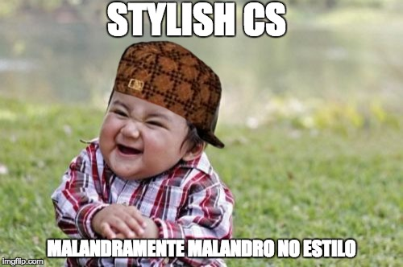

<h1 align="center">Certsys Stylish</h1>
 

  :dark_sunglasses: Styleguides alegres e ousados da Certsys :dark_sunglasses:

---

> Iniciar um novo projeto, é um momento lindo e maravilhoso, manter o projeto e garantir que seja mantido toda a qualidade, estrutura e afins é muito phoda.
Aqui segue a lista de luzes para vossos caminhos, escrito e utilizado (ou tetando...) aqui na [Certsys](http://certsys.com.br).
Se você deseja compartilhar melhores práticas suas, ou acha que alguma dessas ideias de maconheiro deva ser removida, guarde pra você esse desejo! Brinks :smiley:, [sinta-se livre para mandar um pull request lindão](http://makeapullrequest.com).

## Guias para a vida

* [Guia do Git Campeão](git/README.md)
* [Guia do Commit Amigão](git/COMMIT_CAMPEAO.md)
* [Guia das Práticas Ninjas](praticas/README.md)
* [README bom e safadão de Exemplo](readme/README.md)
* [Manifesto +++ Lindo do Time (BORA fazer?)](praticas/TEAM_MANIFESTO.md)