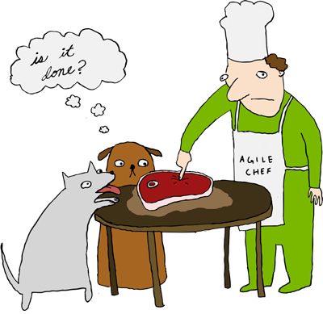

# DoD - Defition of Done
> For beautiful eyes, look for the good in others; 
> for beautiful lips, speak only words of kindness; and for poise, 
> walk with the knowledge that you are never alone.

#### Overview
O DoD é uma lista simples de atividades (códificar, comentários, teste unitários, teste de integração, etc.) 
que adicionam valor ao produto. Concentrar-se em etapas de valor agregado permite que a equipe se concentre no que 
deve ser concluído para criar software, ao mesmo tempo em que elimina atividades desperdiçadas que só 
complicam os esforços do desenvolvimento de software.

 > DoD é o principal mecanismo de relatórios para os membros da equipe.

O relatório na sua forma mais simples é a capacidade de dizer, "Este recurso está pronto". 
Afinal, um recurso ou Item do PB está feito ou não está feito. O DoD é um artefato simples que acrescenta 
clareza à declaração "Feature's done". Usando o DoD como referência para essa conversa, um membro da equipe 
pode efetivamente atualizar outros membros da equipe e o PO.

[]

#### Por que queremos um DoD? E por que você precisa saber?
A definição de feito é ortogonal aos critérios de aceitação do usuário (aceitação funcional) para um recurso. 
É uma lista de verificação abrangente das atividades necessárias, de valor agregado que afirmam a qualidade de 
um recurso e não a funcionalidade desse recurso. A definição de feito é informada pela realidade, 
onde captura atividades que podem ser cometidas realisticamente pela equipe para ser 
completada em cada nível (recurso, sprint, lançamento).

#### O que temos no nosso DoD?
 - TDD
 - BDD
 - Qualidade de Código (Lint)
 - Code Review
 - Aprovação do PO 

### To-Dos
 - Sempre melhorar essa po*$a :godmode:
 - [Ver o DoR](DoR.md) :anger:
 - Ver o nosso [lindo Manifesto](TEAM_MANIFESTO.md) :panda_face:

License
----

MITchel
